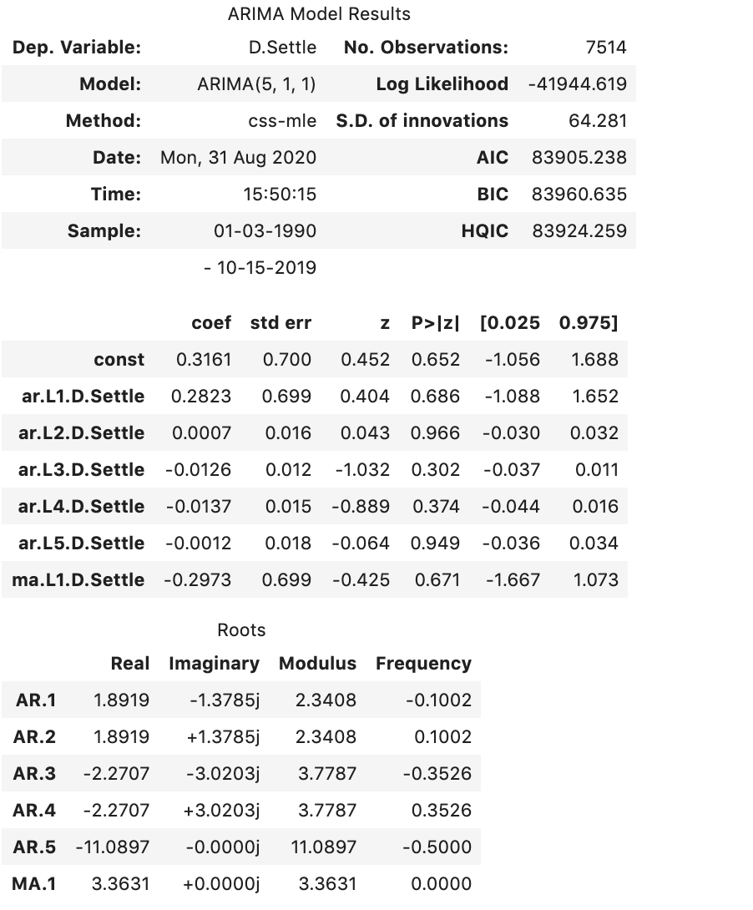
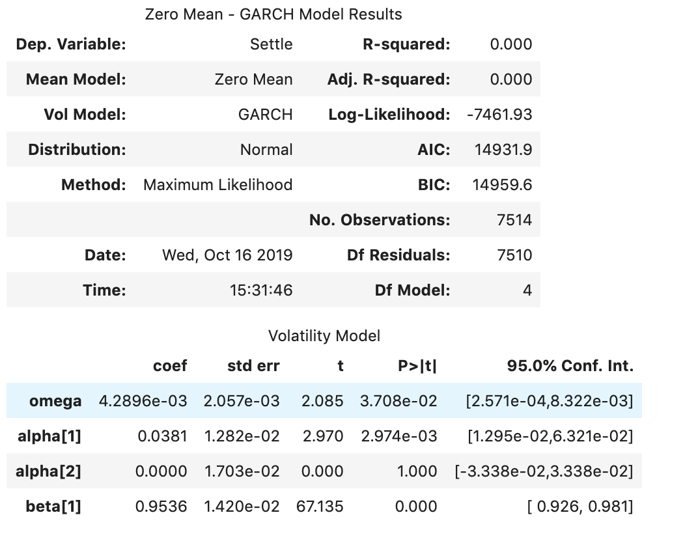

# SUMMARY OF RESULTS

## Time-Series Forecasting

### Based on your time series analysis, would you buy the yen now?

- According to the 5 Day Forecast, the yen may be a good investment in the short-term.

### Is the risk of the yen expected to increase or decrease?

- The risk of the yen is expected to increase in the short-term. The volatility is also expected to increase.

### Based on the model evaluation, would you feel confident in using these models for trading?

- No, I would not feel confident in using these models for trading.

---

## Linear Regression Forecasting

### Does this model perform better or worse on out-of-sample data compared to in-sample data?

The In-Sample performed better than the Out-of-Sample model. The higher the RMSE, the better the model.

Below are the RMSE for both models:

  - Out-of-Sample Root Mean Squared Error (RMSE): 0.41521675083603804
  
  - In-sample Root Mean Squared Error (RMSE): 0.5966748205888165

